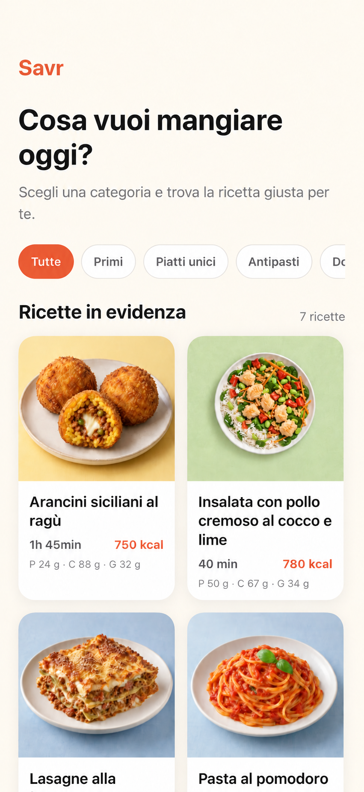
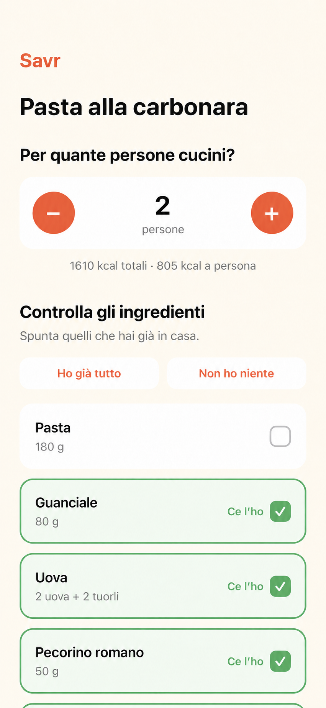
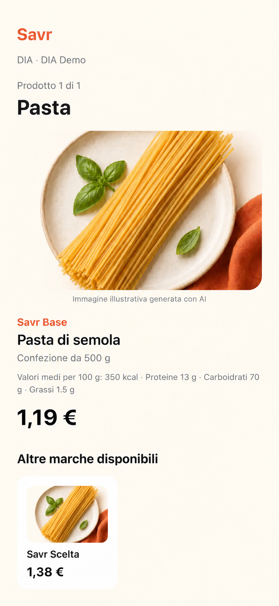
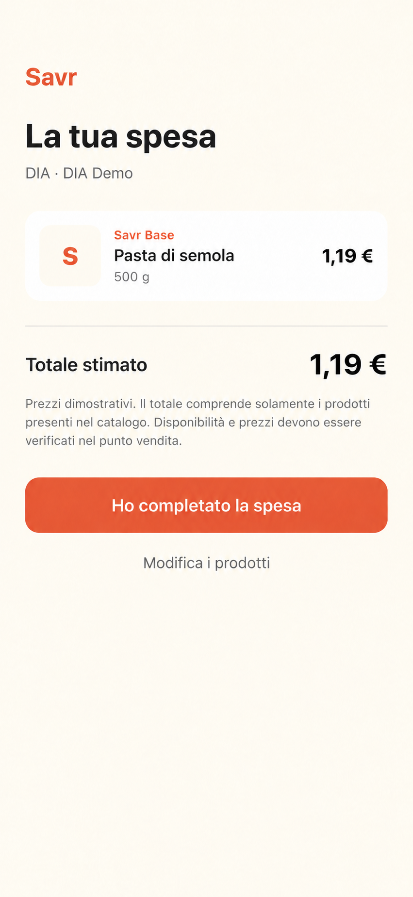

# Savr

Savr is a mobile-first cooking companion that connects recipe discovery, pantry checking, supermarket selection, product comparison, shopping summary, and guided cooking in one continuous flow.

The project was built as a portfolio MVP to explore how a consumer app can reduce the friction between choosing what to cook and actually preparing it.

## Screenshots

<p align="center">
  
  
  
</p>

<p align="center">
  
  
</p>

## What Savr does

- Organizes recipes into categories such as first courses, main dishes, appetizers, desserts, and lighter meals.
- Displays preparation time, calories, and estimated macronutrients per person.
- Scales ingredient quantities according to the selected number of servings.
- Lets users mark the ingredients they already have at home.
- Uses the device location to find nearby supermarkets through OpenStreetMap data.
- Connects supported supermarket chains to a demo product catalogue stored in Supabase.
- Suggests available products, prices, promotions, package sizes, and nutritional values.
- Creates an estimated shopping summary before cooking.
- Provides step-by-step cooking instructions with integrated timers.
- Saves the current session locally so users can resume where they stopped.

## User flow

1. Choose a recipe and the number of servings.
2. Review the scaled ingredient quantities.
3. Mark the ingredients already available at home.
4. Select a nearby supported supermarket.
5. Choose a product for every missing ingredient.
6. Review the estimated shopping list and total.
7. Follow the guided cooking steps and timers.

## Tech stack

| Area | Technology |
| --- | --- |
| Mobile application | React Native 0.86 and Expo SDK 57 |
| Language | TypeScript |
| Navigation | Expo Router |
| Backend and database | Supabase and PostgreSQL |
| Local persistence | AsyncStorage |
| Geolocation | Expo Location |
| Nearby supermarket data | OpenStreetMap Overpass API |
| Image rendering | Expo Image |
| Image optimization | Sharp |
| Code quality | TypeScript and ESLint |

## Architecture

The application separates screen-level UI from data-access services:

```text
src/
├── app/                    # Expo Router screens and navigation flow
│   ├── index.tsx           # Recipe discovery and session resume
│   └── recipe/             # Recipe, supermarket, products, summary, cooking
├── lib/
│   └── supabase.ts         # Supabase client configuration
└── services/
    ├── products.ts         # Product catalogue and price queries
    ├── recipes.ts          # Recipe, ingredient, and cooking-step queries
    ├── session.ts          # Local session state and resume logic
    └── supermarkets.ts     # Supabase catalogue and nearby-store search
```

Supabase stores recipes, ingredients, products, supermarket catalogues, offers, and cooking steps. The mobile client accesses this data through dedicated service functions, while the active cooking and shopping session is stored locally on the device.

## Data model

The main relationships are:

- `recipes` → `recipe_ingredients` → `ingredients`
- `recipes` → `recipe_steps`
- `ingredients` → `ingredient_products` → `products`
- `supermarkets` → `store_products` → `products`
- `store_products` → `offers`

The `store_product_prices` view combines regular prices with currently active offers and exposes the effective price used by the application.

## Security

- Row Level Security is enabled on every public application table.
- Anonymous and authenticated clients receive read-only access through `SELECT` policies.
- Client-side insert, update, and delete operations are not allowed.
- The `store_product_prices` view uses `security_invoker=true`, so it respects the policies of its underlying tables.
- Recipe images are served from a public, read-only Supabase Storage bucket.
- No Supabase service-role key is included in the mobile application or repository.

## Local setup

### Requirements

- Node.js and npm
- Expo Go, an Android emulator, an iOS simulator, or an Expo development build
- A Supabase project containing the required schema and seed data

### Installation

```bash
git clone <repository-url>
cd savr
npm install
```

Create a `.env.local` file in the project root:

```env
EXPO_PUBLIC_SUPABASE_URL=your_supabase_project_url
EXPO_PUBLIC_SUPABASE_PUBLISHABLE_KEY=your_supabase_publishable_key
```

Only use the Supabase publishable key in the application. Never add a service-role key to a client-side environment file.

Start the project:

```bash
npx expo start
```

## Quality checks

```bash
npx tsc --noEmit
npm run lint
```

## Recipe image optimization

Source recipe images can be placed in:

```text
assets/images/recipes/
```

Run the optimization script:

```bash
node scripts/optimize-recipe-images.mjs
```

Optimized WebP files are generated in:

```text
assets/images/recipes-optimized/
```

They can then be uploaded to the public `recipe-images` bucket in Supabase Storage and linked through the `image_url` field of each recipe.

## Current MVP limitations

- Product prices and availability are demonstration data and are not synchronized with supermarket systems in real time.
- Nearby stores come from OpenStreetMap and depend on the completeness and availability of the Overpass API.
- Only supported chains can be connected to the internal demo catalogue.
- Recipe and catalogue management currently takes place through Supabase rather than a dedicated admin interface.
- The application has no user accounts or cross-device session synchronization.

## Roadmap

- Complete the ingredient image library.
- Add clearer preparation, cooking, and resting-time labels.
- Improve empty, offline, location-permission, and network-error states.
- Add automated tests for quantity scaling, session transitions, and price selection.
- Add a small administration workflow for recipes and catalogue data.
- Evaluate official retailer integrations or licensed product-data providers for real prices.
- Produce an installable iOS and Android demo build.

## Demo

A short product demo will be added after the final presentation pass.

## Project status

The core MVP flow is complete and functional. The current focus is interface polish, visual assets, automated testing, and portfolio presentation.
