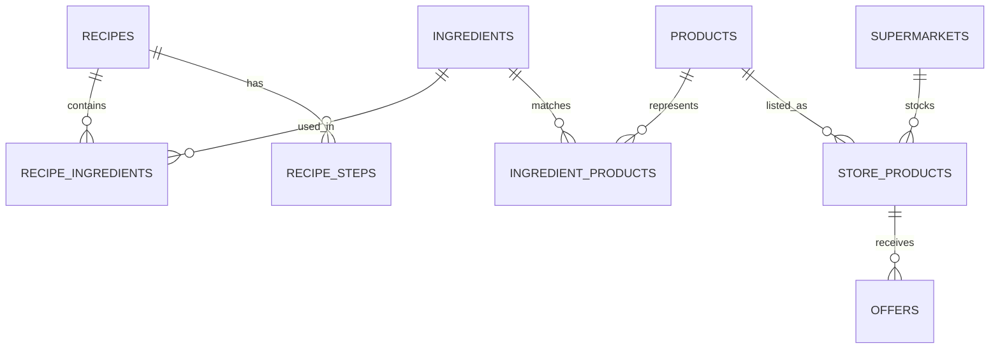

# Savr database architecture

Savr uses Supabase and PostgreSQL as a read-only backend for recipes, ingredients, supermarket catalogues, products, prices, and offers.

The mobile application accesses the database through the Supabase publishable key. All public application tables have Row Level Security enabled and expose only `SELECT` operations to `anon` and `authenticated` roles.

## Entity relationships



## Tables

### `recipes`

Stores the recipe catalogue and the information displayed on the Home screen.

Main fields:

- `id`
- `name`
- `emoji`
- `preparation_minutes`
- `servings`
- `category`
- `image_url`
- `calories_kcal`
- `protein_g`
- `carbohydrates_g`
- `fat_g`
- `is_light`
- `variant_of_recipe_id`
- `created_at`

Nutritional values represent one serving. Ingredient quantities are stored for the recipe's base serving count and scaled by the mobile application.

### `ingredients`

Contains the normalized ingredient catalogue.

Main fields:

- `id`
- `name`
- `default_unit`
- `created_at`

### `recipe_ingredients`

Many-to-many relationship between recipes and ingredients.

Main fields:

- `recipe_id`
- `ingredient_id`
- `quantity`
- `unit`
- `display_quantity`
- `position`

`quantity` and `unit` support automatic serving scaling. `display_quantity` provides a human-friendly fallback for values such as `q.b.`.

### `recipe_steps`

Stores the ordered cooking procedure.

Main fields:

- `id`
- `recipe_id`
- `position`
- `instruction`
- `image_url`
- `timer_seconds`

When `timer_seconds` is present, the cooking screen renders an interactive timer for that step.

### `products`

Contains products independently from the supermarket that sells them.

Main fields:

- `id`
- `barcode`
- `name`
- `brand`
- `image_url`
- `pack_quantity`
- `pack_unit`
- `nutrition`
- `data_source`
- `updated_at`

Nutritional information is stored as JSON to support flexible product data.

### `ingredient_products`

Links a generic cooking ingredient to one or more purchasable products.

Main fields:

- `ingredient_id`
- `product_id`
- `preference_rank`

The preference rank contributes to the ordering of product suggestions.

### `supermarkets`

Stores the internal catalogues currently supported by the MVP.

Main fields:

- `id`
- `chain`
- `name`
- `address`
- `latitude`
- `longitude`

Nearby physical stores are obtained separately from the OpenStreetMap Overpass API. Their chain names are matched to these internal catalogue records.

### `store_products`

Represents a product sold by a specific supermarket.

Main fields:

- `id`
- `supermarket_id`
- `product_id`
- `regular_price`
- `currency`
- `availability`
- `checked_at`

Prices and availability in the current MVP are demonstration data.

### `offers`

Stores time-limited promotional prices.

Main fields:

- `id`
- `store_product_id`
- `sale_price`
- `starts_at`
- `ends_at`
- `enabled`

Only enabled offers within their validity interval and cheaper than the regular price are considered active.

## Effective-price view

The `store_product_prices` view combines `store_products` with the best active offer for each item.

It exposes:

- regular price;
- active sale price;
- effective price;
- promotion status;
- availability;
- offer validity dates.

The effective price is the active promotional price when a valid cheaper offer exists; otherwise it is the regular price.

The view is configured with:

```text
security_invoker=true
```

This ensures that queries respect the Row Level Security policies of the underlying tables.

## Security model

Row Level Security is enabled on:

- `recipes`
- `ingredients`
- `recipe_ingredients`
- `recipe_steps`
- `products`
- `ingredient_products`
- `supermarkets`
- `store_products`
- `offers`

The `anon` and `authenticated` roles have public read policies only. The mobile application cannot insert, modify, or delete database records.

Recipe images are served through a public Supabase Storage bucket. No client-side upload or delete policy is enabled for the bucket's objects.

## External supermarket discovery

The user's foreground location is requested through Expo Location. Savr sends the coordinates to the OpenStreetMap Overpass API and requests supermarkets within a five-kilometre radius.

The returned physical stores are:

1. normalized by chain and store name;
2. matched against supported Supabase catalogues;
3. ordered by catalogue availability and distance;
4. displayed as selectable only when a matching catalogue exists.

No user location is stored in Supabase.

## Current data limitations

- Prices and availability are demonstration values.
- The Overpass API depends on OpenStreetMap coverage and service availability.
- Catalogue matching currently supports the supermarket chains represented in the seed data.
- Database content is managed through Supabase rather than a dedicated administration interface.
